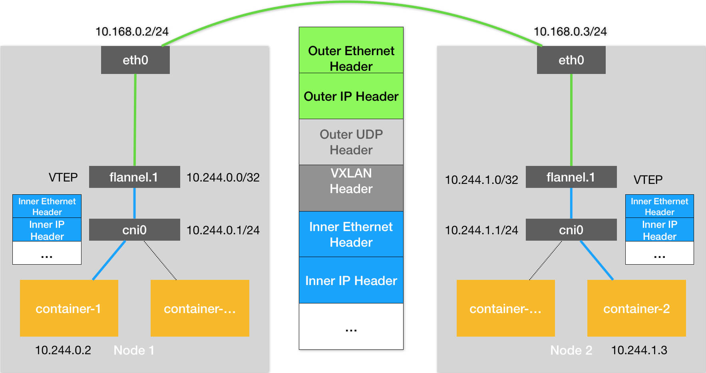

# Kubernetes 网络模型与 CNI 网络插件

## 1. 概述

之前讲述的 Flannel 插件的 UDP 和 VXLAN 实现都有一个共性。

那就是用户的容器都连接在 docker0 网桥上。而网络插件则在宿主机上创建了一个特殊的设备（UDP 模式创建的是 TUN 设备，VXLAN 模式创建的则是 VTEP 设备），docker0 与这个设备之间，通过 IP 转发（路由表）进行协作。

然后，网络插件真正要做的事情，则是通过某种方法，把不同宿主机上的特殊设备连通，从而达到容器跨主机通信的目的。

实际上，上面这个流程，也正是 Kubernetes 对容器网络的主要处理方法。**只不过，Kubernetes 是通过一个叫作 CNI 的接口，维护了一个单独的网桥来代替 docker0。这个网桥的名字就叫作：CNI 网桥，它在宿主机上的设备名称默认是：cni0**。


具体流程如下：




需要注意的是，CNI 网桥只是接管所有 CNI 插件负责的、即 Kubernetes 创建的容器（Pod）。

> 单独用 docker run 跑起来的容器，还是会连接到 docker0 网桥。


Kubernetes 之所以要设置这样一个与 docker0 网桥功能几乎一样的 CNI 网桥，主要原因包括两个方面：

* 一方面，Kubernetes 项目并没有使用 Docker 的网络模型（CNM），所以它并不希望、也不具备配置 docker0 网桥的能力；
* 另一方面，这还与 Kubernetes 如何配置 Pod，也就是 Infra 容器的 Network Namespace 密切相关。

所以，CNI 的设计思想，就是：**Kubernetes 在启动 Infra 容器之后，就可以直接调用 CNI 网络插件，为这个 Infra 容器的 Network Namespace，配置符合预期的网络栈**。

> 一个 Network Namespace 的网络栈包括：网卡（Network Interface）、回环设备（Loopback Device）、路由表（Routing Table）和 iptables 规则。


## 2. 部署

我们在部署 Kubernetes 的时候，有一个步骤是安装 `kubernetes-cni` 包，它的目的就是在宿主机上安装**CNI 插件所需的基础可执行文件**。

在安装完成后，你可以在宿主机的 /opt/cni/bin 目录下看到它们，如下所示：

```sh
[root@iZ2ze2m9cbk2et61zx1pl5Z ~]# ls -al /opt/cni/bin/
total 47080
drwxr-xr-x 2 root root    4096 Jan 23 15:24 .
drwxr-xr-x 3 root root    4096 Jan 23 15:24 ..
-rwxr-xr-x 1 root root 2805744 Nov 17 15:31 bandwidth
-rwxr-xr-x 1 root root 3138656 Nov 17 15:31 bridge
-rwxr-xr-x 1 root root 7784520 Nov 17 15:31 dhcp
-rwxr-xr-x 1 root root 3922624 Nov 17 15:31 firewall
-rwxr-xr-x 1 root root 2100184 Nov 17 15:31 flannel
-rwxr-xr-x 1 root root 2800200 Nov 17 15:31 host-device
-rwxr-xr-x 1 root root 2416832 Nov 17 15:31 host-local
-rwxr-xr-x 1 root root 2905296 Nov 17 15:31 ipvlan
-rwxr-xr-x 1 root root 2169136 Nov 17 15:31 loopback
-rwxr-xr-x 1 root root 2956320 Nov 17 15:31 macvlan
-rwxr-xr-x 1 root root 2660944 Nov 17 15:31 portmap
-rwxr-xr-x 1 root root 3085600 Nov 17 15:31 ptp
-rwxr-xr-x 1 root root 2324768 Nov 17 15:31 sbr
-rwxr-xr-x 1 root root 1968368 Nov 17 15:31 static
-rwxr-xr-x 1 root root 2227072 Nov 17 15:31 tuning
-rwxr-xr-x 1 root root 2905208 Nov 17 15:31 vlan
```


这些 CNI 的基础可执行文件，按照功能可以分为三类：

* **第一类，叫作 Main 插件，它是用来创建具体网络设备的二进制文件**。比如，bridge（网桥设备）、ipvlan、loopback（lo 设备）、macvlan、ptp（Veth Pair 设备），以及 vlan。前面提到过的 Flannel、Weave 等项目，都属于“网桥”类型的 CNI 插件。

* **第二类，叫作 IPAM（IP Address Management）插件，它是负责分配 IP 地址的二进制文件**。比如，dhcp，这个文件会向 DHCP 服务器发起请求；host-local，则会使用预先配置的 IP 地址段来进行分配。
* **第三类，是由 CNI 社区维护的内置 CNI 插件**。比如：flannel，就是专门为 Flannel 项目提供的 CNI 插件；tuning，是一个通过 sysctl 调整网络设备参数的二进制文件；portmap，是一个通过 iptables 配置端口映射的二进制文件；bandwidth，是一个使用 Token Bucket Filter (TBF) 来进行限流的二进制文件。

从这些二进制文件中，我们可以看到，如果要实现一个给 Kubernetes 用的容器网络方案，其实需要做两部分工作，以 Flannel 项目为例：

**首先，实现这个网络方案本身**。这一部分需要编写的，其实就是 flanneld 进程里的主要逻辑。比如，创建和配置 flannel.1 设备、配置宿主机路由、配置 ARP 和 FDB 表里的信息等等。

**然后，实现该网络方案对应的 CNI 插件**。这一部分主要需要做的，就是配置 Infra 容器里面的网络栈，并把它连接在 CNI 网桥上。

由于 Flannel 项目对应的 CNI 插件已经被内置了，所以它无需再单独安装。而对于 Weave、Calico 等其他项目来说，我们就必须在安装插件的时候，把对应的 CNI 插件的可执行文件放在 /opt/cni/bin/ 目录下。


接下来，你就需要在宿主机上**安装 flanneld（网络方案本身）**。而在这个过程中，flanneld 启动后会在每台宿主机上生成它对应的 CNI 配置文件（它其实是一个 ConfigMap），从而告诉 Kubernetes，这个集群要使用 Flannel 作为容器网络方案。

这个 CNI 配置文件的内容如下所示：

```sh
[root@iZ2ze2m9cbk2et61zx1pl5Z net.d]# cat /etc/cni/net.d/10-flannel.conf 
{
  "name": "cb0",
  "cniVersion":"0.3.0",
  "type": "flannel",
  "delegate": {
    "isDefaultGateway": true
  }
}
```

需要注意的是，在 Kubernetes 中，处理容器网络相关的逻辑并不会在 kubelet 主干代码里执行，而是会在具体的 CRI（Container Runtime Interface，容器运行时接口）实现里完成。

> 对于 Docker 项目来说，它的 CRI 实现叫作 dockershim

所以，接下来 dockershim 会加载上述的 CNI 配置文件。

**这时候，dockershim 会把这个 CNI 配置文件加载起来，并且把列表里的第一个插件、也就是 flannel 插件，设置为默认插件**。


## 3. CNI 原理

当 kubelet 组件需要创建 Pod 的时候，它第一个创建的一定是 Infra 容器。所以在这一步，dockershim 就会先调用 Docker API 创建并启动 Infra 容器，紧接着执行一个叫作 SetUpPod 的方法。这个方法的作用就是：为 CNI 插件准备参数，然后调用 CNI 插件为 Infra 容器配置网络。

### 准备参数

这里要调用的 CNI 插件，就是 /opt/cni/bin/flannel；而调用它所需要的参数，分为两部分：

**1）第一部分，是由 dockershim 设置的一组 CNI 环境变量**。

其中，最重要的环境变量参数叫作：CNI_COMMAND。它的取值只有两种：ADD 和 DEL。

其中 ADD 操作的含义是：把容器添加到 CNI 网络里；DEL 操作的含义则是：把容器从 CNI 网络里移除掉。

> 而对于网桥类型的 CNI 插件来说，这两个操作意味着把容器以 Veth Pair 的方式“插”到 CNI 网桥上（ADD），或者从网桥上“拔”掉（DEL）。

**这个 ADD 和 DEL 操作，就是 CNI 插件唯一需要实现的两个方法**。

**2）第二部分，则是 dockershim 从 CNI 配置文件里加载到的、默认插件的配置信息**。

这个配置信息在 CNI 中被叫作 Network Configuration，dockershim 会把 Network Configuration 以 JSON 数据的格式，通过标准输入（stdin）的方式传递给 Flannel CNI 插件。

不过，需要注意的是，Flannel 的 CNI 配置文件（ /etc/cni/net.d/10-flannel.conf）里有这么一个字段，叫作 delegate：

```sh
  "delegate": {
    "isDefaultGateway": true
  }
```

Delegate 字段的意思是，这个 CNI 插件并不会自己做事儿，而是会调用 Delegate 指定的某种 CNI 内置插件来完成。

> 对于 Flannel 来说，它调用的 Delegate 插件，就是前面介绍到的 CNI bridge 插件。

所以说，dockershim 对 Flannel CNI 插件的调用，其实就是走了个过场。**Flannel CNI 插件唯一需要做的，就是对 dockershim 传来的 Network Configuration 进行补充**。比如，将 Delegate 的 Type 字段设置为 bridge，将 Delegate 的 IPAM 字段设置为 host-local 等。

经过 Flannel CNI 插件补充后的、完整的 Delegate 字段如下所示：

```json

{
    "hairpinMode":true,
    "ipMasq":false,
    "ipam":{
        "routes":[
            {
                "dst":"172.20.0.0/16"
            }
        ],
        "subnet":"172.20.16.1/25",
        "type":"host-local"
    },
    "isDefaultGateway":true,
    "mtu":1500,
    "name":"cbr0",
    "type":"bridge"
}
```

其中，ipam 字段里的信息，比如 10.244.1.0/24，读取自 Flannel 在宿主机上生成的 Flannel 配置文件，即：宿主机上的 `/run/flannel/subnet.env` 文件。

### 配置网络

接下来，Flannel CNI 插件就会调用 CNI bridge 插件，也就是执行：/opt/cni/bin/bridge 二进制文件。

**1）检测 cni0 网桥，不存在则创建；**

首先，CNI bridge 插件会在宿主机上检查 CNI 网桥是否存在。如果没有的话，那就创建它。这相当于在宿主机上执行：

```sh
# 在宿主机上
$ ip link add cni0 type bridge
$ ip link set cni0 up
```

**2）在容器Namespace中创建一对 Veth-Pair，并将其中一段移动到宿主机Namespace；**

接下来，CNI bridge 插件会通过 Infra 容器的 Network Namespace 文件，进入到这个 Network Namespace 里面，然后创建一对 Veth Pair 设备。

紧接着，它会把这个 Veth Pair 的其中一端，“移动”到宿主机上。这相当于在容器里执行如下所示的命令：

```sh
#在容器里

# 创建一对Veth Pair设备。其中一个叫作eth0，另一个叫作vethb4963f3
$ ip link add eth0 type veth peer name vethb4963f3

# 启动eth0设备
$ ip link set eth0 up 

# 将Veth Pair设备的另一端（也就是vethb4963f3设备）放到宿主机（也就是Host Namespace）里
$ ip link set vethb4963f3 netns $HOST_NS

# 通过Host Namespace，启动宿主机上的vethb4963f3设备
$ ip netns exec $HOST_NS ip link set vethb4963f3 up 
```

这样，vethb4963f3 就出现在了宿主机上，而且这个 Veth Pair 设备的另一端，就是容器里面的 eth0。

> 当然，上述创建 Veth Pair 设备的操作，其实也可以先在宿主机上执行，然后再把该设备的一端放到容器的 Network Namespace 里，这个原理是一样的。

不过，CNI 插件之所以要“反着”来，是因为 CNI 里对 Namespace 操作函数的设计就是如此，如下所示：

```go
err := containerNS.Do(func(hostNS ns.NetNS) error {
  ...
  return nil
})
```

在编程时，容器的 Namespace 是可以直接通过 Namespace 文件拿到的；而 Host Namespace，则是一个隐含在上下文的参数。

所以，像上面这样，**先通过容器 Namespace 进入容器里面，然后再反向操作 Host Namespace，对于编程来说要更加方便**。

**3）把宿主机上的 Veth-Pair 连接到 cni0 网桥，并开启开启 Hairpin Mode；**

接下来，CNI bridge 插件就可以把 vethb4963f3 设备连接在 CNI 网桥上。这相当于在宿主机上执行：

```sh
# 在宿主机上
$ ip link set vethb4963f3 master cni0
```

在将 vethb4963f3 设备连接在 CNI 网桥之后，CNI bridge 插件还会为它设置 **Hairpin Mode（发夹模式）**。这是因为，在默认情况下，网桥设备是不允许一个数据包从一个端口进来后，再从这个端口发出去的。但是，它允许你为这个端口开启 Hairpin Mode，从而取消这个限制。

> 比如我们执行 docker run -p 8080:80，就是在宿主机上通过 iptables 设置了一条 DNAT 转发规则，即访问宿主机8080端口的请求会转发给容器的80端口。
>
> 但如果你是在容器里面访问宿主机的 8080 端口，那么这个容器里发出的 IP 包会经过 vethb4963f3 设备（端口）和 docker0 网桥，来到宿主机上。此时，根据上述 DNAT 规则，这个 IP 包又需要回到 docker0 网桥，并且还是通过 vethb4963f3 端口进入到容器里。
>
> 所以，这种情况下，我们就需要开启 vethb4963f3 端口的 Hairpin Mode 了。

所以说，Flannel 插件要在 CNI 配置文件里声明 hairpinMode=true。这样，将来这个集群里的 Pod 才可以通过它自己的 Service 访问到自己。

**4）为容器分配 IP；**

接下来，CNI bridge 插件会调用 CNI ipam 插件，从 ipam.subnet 字段规定的网段里为容器分配一个可用的 IP 地址。

然后，CNI bridge 插件就会把这个 IP 地址添加在容器的 eth0 网卡上，同时为容器设置默认路由。这相当于在容器里执行：

```sh
# 在容器里
$ ip addr add 10.244.0.2/24 dev eth0
$ ip route add default via 10.244.0.1 dev eth0
```

**5）为 cni0 网桥分配 IP。**

最后，CNI bridge 插件会为 CNI 网桥添加 IP 地址。这相当于在宿主机上执行：

```sh
# 在宿主机上
$ ip addr add 10.244.0.1/24 dev cni0
```

在执行完上述操作之后，CNI 插件会把容器的 IP 地址等信息返回给 dockershim，然后被 kubelet 添加到 Pod 的 Status 字段。

至此，CNI 插件的 ADD 方法就宣告结束了。接下来的流程，就跟我们上一篇文章中容器跨主机通信的过程完全一致了。


## 4. 小结

**CNI 具体过程**：

* 1）kubelet 创建 Pod，第一个启动的肯定是 Infra 容器（具体容器启动过程由 CRI 实现）。
* 2）CRI 启动 Infra 容器后紧接着执行一个叫作 SetUpPod 的方法。这个方法的作用就是：为 CNI 插件准备参数，然后调用 CNI 插件为 Infra 容器配置网络。


**CNI 插件参数来源**：

* 1）由 CRI 设置的一组 CNI 环境变量提供；
* 2）CNI 配置文件中的默认插件配置信息。


**CNI 网络配置过程**：

* 1）检测 cni0 网桥，不存在则创建；
* 2）在容器Namespace中创建一对 Veth-Pair，并将其中一段移动到宿主机Namespace；
* 3）把宿主机上的 Veth-Pair 连接到 cni0 网桥，并开启开启 Hairpin Mode；
* 4）为容器分配 IP；
* 5）为 cni0 网桥分配 IP。


**Kubernetes 网络模型**：

* 1）所有容器都可以直接使用 IP 地址与其他容器通信，而无需使用 NAT。
* 2）所有宿主机都可以直接使用 IP 地址与所有容器通信，而无需使用 NAT。反之亦然。
* 3）容器自己“看到”的自己的 IP 地址，和别人（宿主机或者容器）看到的地址是完全一样的。

可以看到，这个网络模型，其实可以用一个字总结，那就是“通”。

容器与容器之间要“通”，容器与宿主机之间也要“通”。并且，Kubernetes 要求这个“通”，还必须是直接基于容器和宿主机的 IP 地址来进行的。