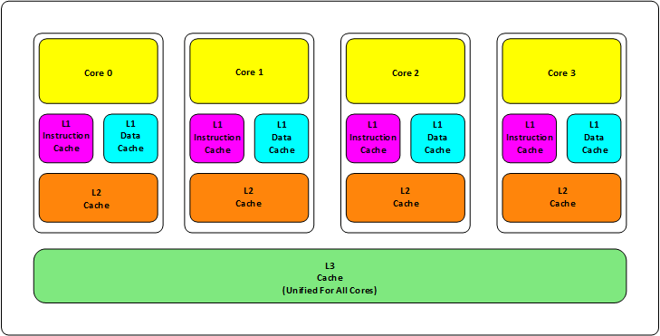
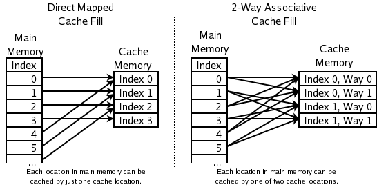
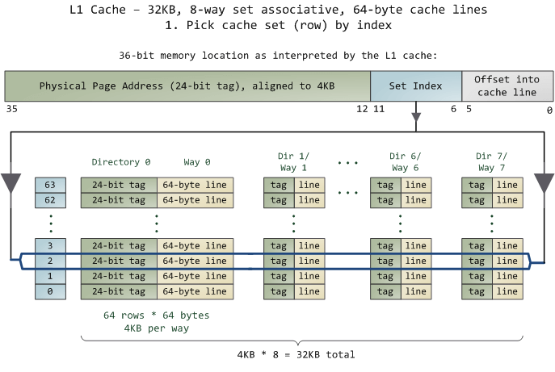
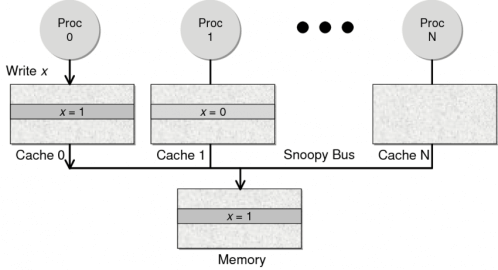
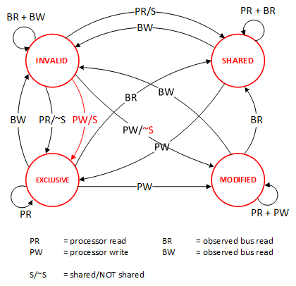

# CPU 缓存

## 1. 概述

> 来源 https://coolshell.cn/articles/20793.html

首先，我们都知道现在的CPU多核技术，都会有几级缓存，老的CPU会有两级内存（L1和L2），新的CPU会有三级内存（L1，L2，L3 ），如下图所示：



其中：

- L1缓存分成两种，一种是指令缓存，一种是数据缓存。L2缓存和L3缓存不分指令和数据。
- L1和L2缓存在每一个CPU核中，L3则是所有CPU核心共享的内存。
- L1、L2、L3的越离CPU近就越小，速度也越快，越离CPU远，速度也越慢。

再往后面就是内存，内存的后面就是硬盘。我们来看一些他们的速度：

- L1 的存取速度：**4 个CPU时钟周期**
- L2 的存取速度： **11 个CPU时钟周期**
- L3 的存取速度：**39 个CPU时钟周期**
- RAM内存的存取速度**：107 个CPU时钟周期**


## 2. 缓存命中

在说明这两个问题之前。我们需要要解一个术语 Cache Line。缓存基本上来说就是把后面的数据加载到离自己近的地方，对于CPU来说，它是不会一个字节一个字节的加载的，因为这非常没有效率，一般来说都是要一块一块的加载的，对于这样的一块一块的数据单位，术语叫“Cache Line”，一般来说，一个主流的CPU的Cache Line 是 64 Bytes（也有的CPU用32Bytes和128Bytes），64Bytes也就是16个32位的整型，这就是CPU从内存中捞数据上来的最小数据单位。


一方面，缓存需要把内存里的数据放到放进来，英文叫 CPU Associativity。Cache的数据放置的策略决定了内存中的数据块会拷贝到CPU Cache中的哪个位置上，因为Cache的大小远远小于内存，所以，需要有一种地址关联的算法，能够让内存中的数据可以被映射到Cache中来。这个有点像内存地址从逻辑地址向物理地址映射的方法，但不完全一样。


- 一种方法是，任何一个内存地址的数据可以被缓存在任何一个Cache Line里，这种方法是最灵活的，但是，如果我们要知道一个内存是否存在于Cache中，我们就需要进行O(n)复杂度的Cache遍历，这是很没有效率的。
- 另一种方法，为了降低缓存搜索算法，我们需要使用像Hash Table这样的数据结构，最简单的hash table就是做“求模运算”，比如：我们的L1 Cache有512个Cache Line，那么，公式：`（内存地址 mod 512）* 64` 就可以直接找到所在的Cache地址的偏移了。但是，这样的方式需要我们的程序对内存地址的访问要非常地平均，不然冲突就会非常严重。这成了一种非常理想的情况了。
- 为了避免上述的两种方案的问题，于是就要容忍一定的hash冲突，也就出现了 N-Way 关联。也就是把连续的N个Cache Line绑成一组，然后，先把找到相关的组，然后再在这个组内找到相关的Cache Line。这叫 Set Associativity。如下图所示。




ntel 大多数处理器的L1 Cache都是32KB，8-Way 组相联，Cache Line 是64 Bytes。这意味着，

- 32KB的可以分成，32KB / 64 = 512 条 Cache Line。
- 因为有8 Way，于是会每一Way 有 512 / 8 = 64 条 Cache Line。
- 于是每一路就有 64 x 64 = 4096 Byts 的内存。

为了方便索引内存地址，

- **Tag**：每条 Cache Line 前都会有一个独立分配的 24 bits来存的 tag，其就是内存地址的前24bits
- **Index**：内存地址后续的6个bits则是在这一Way的是Cache Line 索引，6bits 能存储2^6 = 64 刚好可以索引64条Cache Line
- **Offset**：再往后的6bits用于表示在Cache Line 里的偏移量

当拿到一个内存地址的时候，先拿出中间的 6bits 来，找到是哪组。



然后，在这一个8组的cache line中，再进行O(n) n=8 的遍历，主是要匹配前24bits的tag。如果匹配中了，就算命中，如果没有匹配到，那就是cache miss，如果是读操作，就需要进向后面的缓存进行访问了。L2/L3同样是这样的算法。而淘汰算法有两种，一种是随机一种是LRU。现在一般都是以LRU的算法（通过增加一个访问计数器来实现）


## 3. 缓存一致性

对于主流的CPU来说，缓存的写操作基本上是两种策略:

- 一种是Write Back，写操作只要在cache上，然后再flush到内存上。
- 一种是Write Through，写操作同时写到cache和内存上。

为了提高写的性能，一般来说，主流的CPU（如：Intel Core i7/i9）采用的是Write Back的策略，因为直接写内存实在是太慢了。

如果有一个数据 x 在 CPU 第0核的缓存上被更新了，那么其它CPU核上对于这个数据 x 的值也要被更新，这就是缓存一致性的问题。

现在基本都是使用Snoopy的总线的设计来解决该问题。

**Snoopy 协议**。这种协议更像是一种数据通知的总线型的技术。CPU Cache通过这个协议可以识别其它Cache上的数据状态。如果有数据共享的话，可以通过广播机制将共享数据的状态通知给其它CPU Cache。这个协议要求每个CPU Cache 都可以***“\*窥探\*”\***数据事件的通知并做出相应的反应。如下图所示，有一个Snoopy Bus的总线。



这里介绍几个状态协议，先从最简单的开始，MESI协议，其主要表示缓存数据有四个状态：Modified（已修改）, Exclusive（独占的）,Shared（共享的），Invalid（无效的）。



下面是个示例（如果你想看一下动画演示的话，这里有一个网页（[MESI Interactive Animations](https://www.scss.tcd.ie/Jeremy.Jones/VivioJS/caches/MESIHelp.htm)），你可以进行交互操作，这个动画演示中使用的Write Through算法）：

| 当前操作           | CPU0    | CPU1   | Memory | 说明                                                         |
| :----------------- | :------ | :----- | :----- | :----------------------------------------------------------- |
| 1) CPU0 read(x)    | x=1 (E) |        | x=1    | 只有一个CPU有 x 变量， 所以，状态是 Exclusive                |
| 2) CPU1 read(x)    | x=1 (S) | x=1(S) | x=1    | 有两个CPU都读取 x 变量， 所以状态变成 Shared                 |
| 3) CPU0 write(x,9) | x=9 (M) | x=1(I) | x=1    | 变量改变，在CPU0中状态 变成 Modified，在CPU1中 状态变成 Invalid |
| 4) 变量 x 写回内存 | x=9 (M) | X=1(I) | x=9    | 目前的状态不变                                               |
| 5) CPU1 read(x)    | x=9 (S) | x=9(S) | x=9    | 变量同步到所有的Cache中， 状态回到Shared                     |

 

MESI 这种协议在数据更新后，会标记其它共享的CPU缓存的数据拷贝为Invalid状态，然后当其它CPU再次read的时候，就会出现 cache miss 的问题，此时再从内存中更新数据。从内存中更新数据意味着20倍速度的降低。我们能不能直接从我隔壁的CPU缓存中更新？是的，这就可以增加很多速度了，但是状态控制也就变麻烦了。还需要多来一个状态：Owner(宿主)，用于标记，我是更新数据的源。于是，出现了 [MOESI 协议](https://en.wikipedia.org/wiki/MOESI_protocol)

MOESI协议的状态机和演示示例我就不贴了（有兴趣可以上[Berkeley上看看相关的课件](https://inst.eecs.berkeley.edu/~cs61c/su18/disc/11/Disc11Sol.pdf)），**我们只需要理解MOESI协议允许 CPU Cache 间同步数据，于是也降低了对内存的操作**，性能是非常大的提升，但是控制逻辑也非常复杂。

顺便说一下，与 MOESI 协议类似的一个协议是 [MESIF](https://en.wikipedia.org/wiki/MESIF_protocol)，其中的 F 是 Forward，同样是把更新过的数据转发给别的 CPU Cache 但是，MOESI 中的 Owner 状态 和MESIF 中的 Forward 状态有一个非常大的不一样—— **Owner状态下的数据是dirty的，还没有写回内存，Forward状态下的数据是clean的，可以丢弃而不用另行通知**。

需要说明的是，AMD用MOESI，Intel用MESIF。所以，F 状态主要是针对 CPU L3 Cache 设计的（前面我们说过，L3是所有CPU核心共享的）。（相关的比较可以参看[StackOverlow上这个问题的答案](https://stackoverflow.com/a/49989985)）


## 4. 程序性能

接下来，我们再来看个示例。下面是一个二维数组的两种遍历方式，一个逐行遍历，一个是逐列遍历，这两种方式在理论上来说，寻址和计算量都是一样的，执行时间应该也是一样的。

```c
package cpucache

const (
	row = 1024
	col = 512
)

var(
	matrix = [row][col]int64{}
	sum int64
)

// Row 逐行遍历
func Row() {
	for i := 0; i < row; i++ {
		for j := 0; j < col; j++ {
			sum += matrix[i][j]
		}
	}
}
// Col 逐列遍历
func Col() {
	for j := 0; j < col; j++ {
		for i := 0; i < row; i++ {
			sum += matrix[i][j]
		}
	}
}
```

然而，并不是，在我的机器上，得到下面的结果。

- 逐行遍历：0.7ms
- 逐列遍历：1.7ms

执行时间有几倍的差距。其中的原因，就是逐列遍历对于CPU Cache 的运作方式并不友好，所以更耗时。